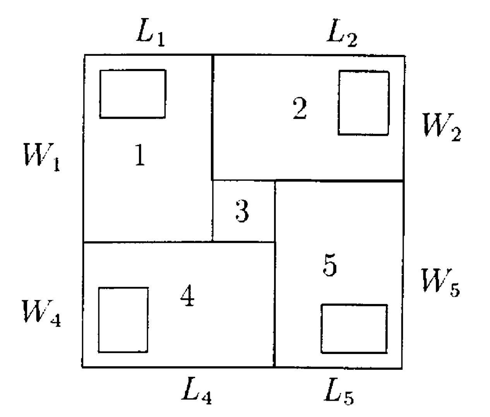

# ¿Cuántos paneles caben?

## Preámbulo: Supuestos

En el resto del documento y en mi solución, voy a asumir lo siguiente:

1. Los paneles van a estar alineados con los lados del techo, vale decir, en orientación horizontal o vertical. Voy a considerar el escenario específico en el que no nos interesa colocar los paneles en diagonal.

2. Todas las dimensiones involucradas son enteras. Si bien el algoritmo funciona para distancias continuas sin problema, preferí acotarlo a enteros para reducir el tiempo de desarrollo.

## Para usar el código

### Probar que esté todo funcionando

El proyecto está desarrollado en Rust. Para poder correrlo, se necesita instalar la _toolchain_ del lenguaje: [Install Rust](https://www.rust-lang.org/tools/install).

Teniendo a Rust instalado, basta con abrir una terminal en el directorio del repositorio y lanzar el proyecto usando Cargo:

> `cargo run`

Esto va a ejecutar el código de la función `main`, que se encuentra en `./src/main.rs`

Para ejecutar la suite de pruebas canónicas:

> `cargo test -- --nocapture`

Esto va a ejecutar las pruebas y mostrará estadísticas (en la terminal) sobre la optimalidad de las soluciones encontradas.

### Para usar la función

La función que calcula la cantidad de paneles está en el archivo `./src/lib.rs`:

```rust
cuantos_caben_b_y_d(w: u32, l: u32, W: u32, L: u32, draw: bool) -> u32
```

Sus parámetros son:

* `w`: el ancho de los paneles
* `l`: el largo de los paneles
* `W`: el ancho del techo
* `L`: el largo del techo
* `draw`: parámetro que le indica al programa si se desea generar una imagen de cada solución probada. Las imágenes que genera el programa para cada instancia del problema quedan bajo el directorio `renders/wxl_into_WxL/`.

El valor retornado por la función es la cantidad de paneles de la mejor solución encontrada.

## Descripción de la Solución

En la función, utilizo una heurística (aproximación) que fue descrita por primera vez en 1982 por Bischoff y Dowsland[^1]. Esta heurística se basa en 2 cosas importantes:

1. La experiencia de que ciertos patrones de 5 bloques suelen llevar a un muy buen uso del espacio disponible:

<p align="center">
    
</p>

2. El conocimiento de que un rectángulo pequeño de dimensiones `(l, w)` cabe de forma exacta (sin restos) en un rectángulo de lados `(n·l, m·w)` para `n, m` enteros. Esta forma de rellenar el rectángulo de `(n·l, m·w)` se ve de la siguiente forma:

<p align="center">
    
</p>

Lo que se hace en B&D se basa en estas dos cosas:

1. Primero, determinar qué bloques exactos (ie, sin restos) se pueden hacer con los paneles, sujeto a la condición de que el bloque formado quepa en el rectángulo grande.

2. Generar una lista de las combinaciones de bloques exactos que se pueden formar para rellenar las áreas 1, 2, 4 y 5 de la primera imagen.

    > Es importante notar que estas 4 áreas tienen una orientación predeterminada. Esto está bien, pues hay tanta simetría en el sistema que las orientaciones que el área 1 no explora son cubiertas por las áreas 2 y 4. Lo mismo para el área 5 y para las otras dos.

3. Para cada combinación:

    * Determinar cuántos paneles caben en cada bloque exacto. Como son bloques exactos, sabemos de antemano la cantidad máxima de paneles que caben en cada uno.

    * Intentar rellenar el área central (la número 3) con un bloque exacto. Puede que no quepa ninguno, pero si es que cabe uno, hay sólo dos candidatos. Se elige el que utiliza más paneles.

    * Sumar los paneles de los 5 bloques.

    * Se guarda el posicionamiento encontrado si es que la cantidad de paneles puestos es mayor que la más grande encontrada hasta el momento.

El posicionamiento así elegido usa bien el espacio, pero no siempre usa la cantidad óptima de paneles.

Dicho esto, es una buena aproximación, y se utiliza como base para algoritmos más elaborados que sí son óptimos.

## Visualización de la Solución

A continuación podemos ver cómo el algoritmo encuentra el óptimo para el problema de poner paneles de 3x4 en un techo de 20x20:

<p align="center">
    
</p>

## Límites de la Solución

La solución presentada tiene varias limitaciones. Aquí las señalo.

### **No es óptima**

El algoritmo de la solución encuentra buenas soluciones, pero no siempre las mejores.

Elegí implementar este algoritmo porque es la base del algoritmo casi óptimo de 1998 descrito por Morabito y Morales[^2], que a su vez es la pieza central del algoritmo óptimo del 2008 de Birgin, Lobato y Morabito[^3]. 

### **Repite pasos**

La solución no está optimizada al 100%. Lo sé porque existen algunas simetrías conocidas de las que no saco provecho. La heurística es muy eficiente, por lo que no espero que sea un problema para la tarea. Queda como material para próximas iteraciones.

## Contexto

Para contexto rápido, ver el [enunciado original](https://ruufsolar.notion.site/Cu-ntos-paneles-caben-a12d329198dd445a903c5be094816afa).

### Problema

El problema a resolver consiste en encontrar la máxima cantidad de rectángulos de dimensiones “a” y “b” (paneles solares) que caben dentro de un rectángulo de dimensiones “x” e “y” (techo).

### Instrucciones

* Usa el lenguaje/framework que más te acomode. No hay una solución única al problema, por lo que puedes hacer lo que prefieras.

* El algoritmo debe ser una sola función que reciba las dimensiones y retorne un solo integer con la cantidad de paneles que caben.

* No hay restricciones de orientación. Pon todos los rectángulos que puedas en la posición y sentido que prefieras.

* No se pide nada gráfico.

## Bibliografía

[^1]: E. Bischoff & W.B. Dowsland, [An Application of the Micro to Product Design and Distribution](https://link.springer.com/article/10.1057/jors.1982.54).

[^2]: R. Morabito & S. Morales, [A simple and effective recursive procedure for the manufacturer's pallet loading problem](https://www.semanticscholar.org/paper/A-simple-and-effective-recursive-procedure-for-the-Morabito-Morales/a4dd03e607b9e1e3720b99a516d14bf31a3ce854).

[^3]: E. G. Birgin, R. D. Lobato & R. Morabito, [An effective recursive partitioning approach for the packing of identical rectangles in a rectangle](http://www.ime.usp.br/~egbirgin/publications/blm.pdf).